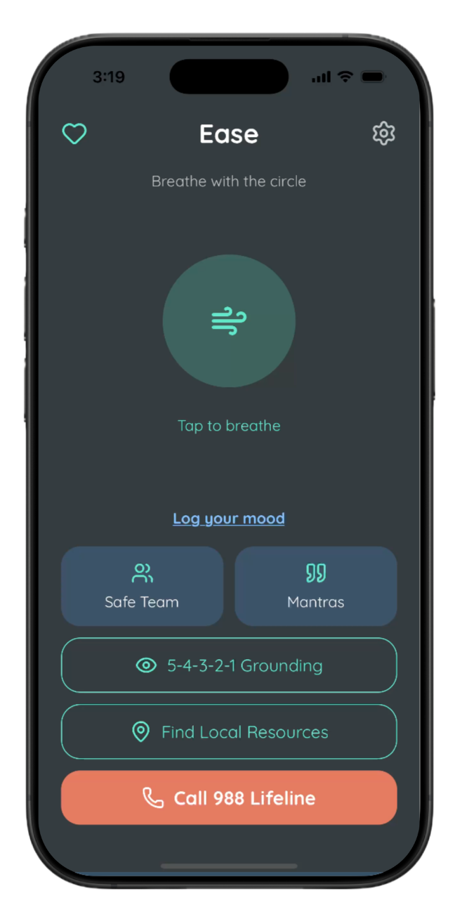
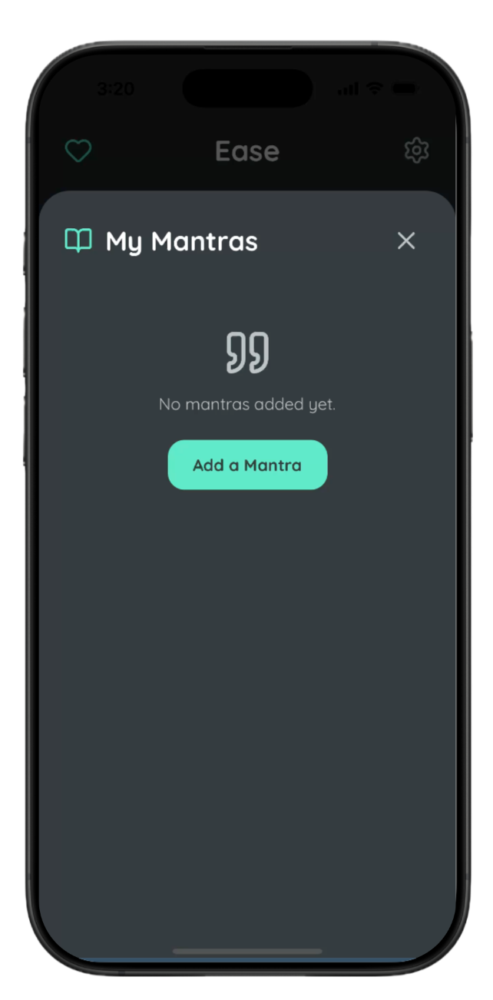
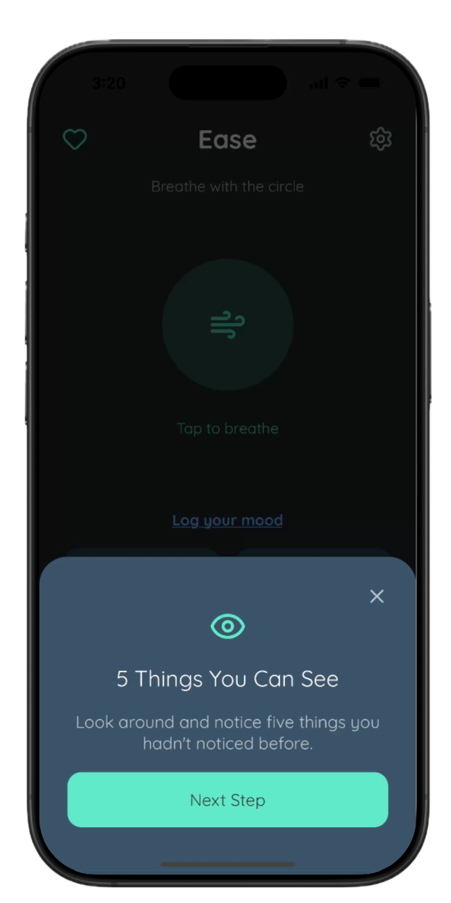
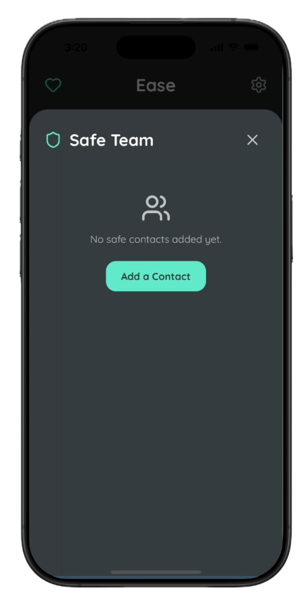
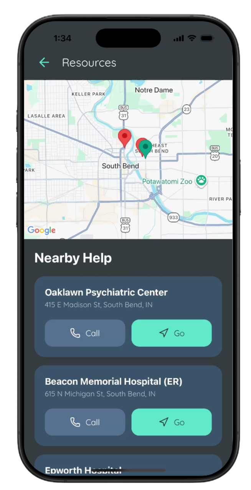
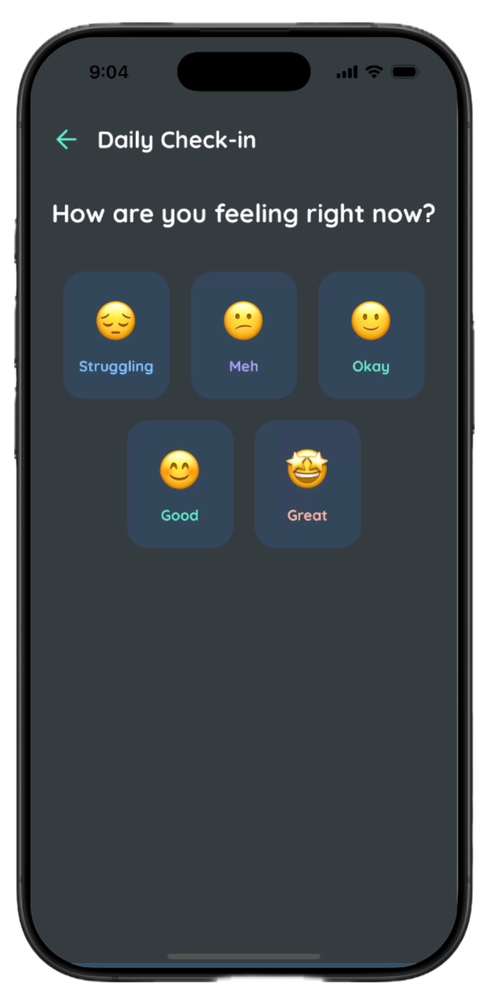
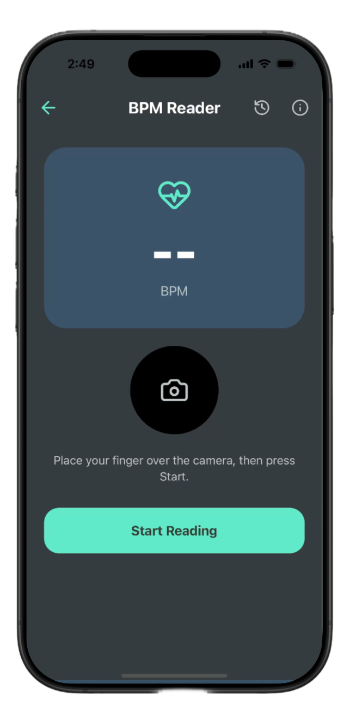

# Ease 🌿

A mindful mobile application designed to provide immediate support during moments of stress or anxiety. Ease offers guided breathing, grounding exercises, and personalized safety tools to help users return to a state of calm.

## 🛠️ Tech Stack

This application is built with a focus on fluid performance and native device integration:

- **Framework:** [React Native](https://reactnative.dev/) with [Expo](https://expo.dev/) (SDK 54).
- **Navigation:** [React Navigation](https://reactnavigation.org/) for seamless screen transitions.
- **Database:** [Expo SQLite](https://docs.expo.dev/versions/latest/sdk/sqlite/) for local persistence of mantras, safety contacts, and mood logs.
- **Animations:** [React Native Reanimated](https://docs.expo.dev/versions/latest/sdk/reanimated/) for high-performance breathing visualizations.
- **Icons:** [Lucide React Native](https://lucide.dev/guide/packages/lucide-react-native).

## 📸 Application Showcase

### 1. Guided Breathing & Mantras

The home screen features an interactive breathing circle with synced haptic feedback and cycling personal mantras.

### 2. 5-4-3-2-1 Grounding Technique

A step-by-step guided sensory exercise to help anchor users in the present moment during high-stress situations.

### 3. Safety Team Integration

Users can import and manage a "Safe Team" of trusted contacts for immediate SOS support.

### 4. Resource Discovery

Integrated mapping via [React Native Maps](https://github.com/react-native-maps/react-native-maps) to locate nearby community centers, shelters, and food pantries.

### 5. Mood Tracking & History

Visualized mood tracking over time to help users identify patterns and progress in their mental wellness journey.

### 6. BPM Readings & History

Users can read and record their Heart Rate BPM using the PPG Method.

## 🚀 Key Features

- **Haptic Feedback:** Sophisticated `expo-haptics` integration that provides physical "thumps" synchronized with the breathing expansion and contraction.
- **Contact Integration:** Direct access to device contacts via `expo-contacts` for quick safety team setup.
- **Personalized Mantras:** A custom local database allowing users to store and cycle through affirmations that resonate with them.
- **Offline First:** All safety plans and history are stored locally on the device for accessibility even without an internet connection.

## ⚙️ Development Setup

1. Clone the repository.
2. Install dependencies: `npm install`.
3. Start the Expo development server: `npx expo start`.
4. Run on a device or emulator:
   - Press `a` for Android.
   - Press `i` for iOS.
